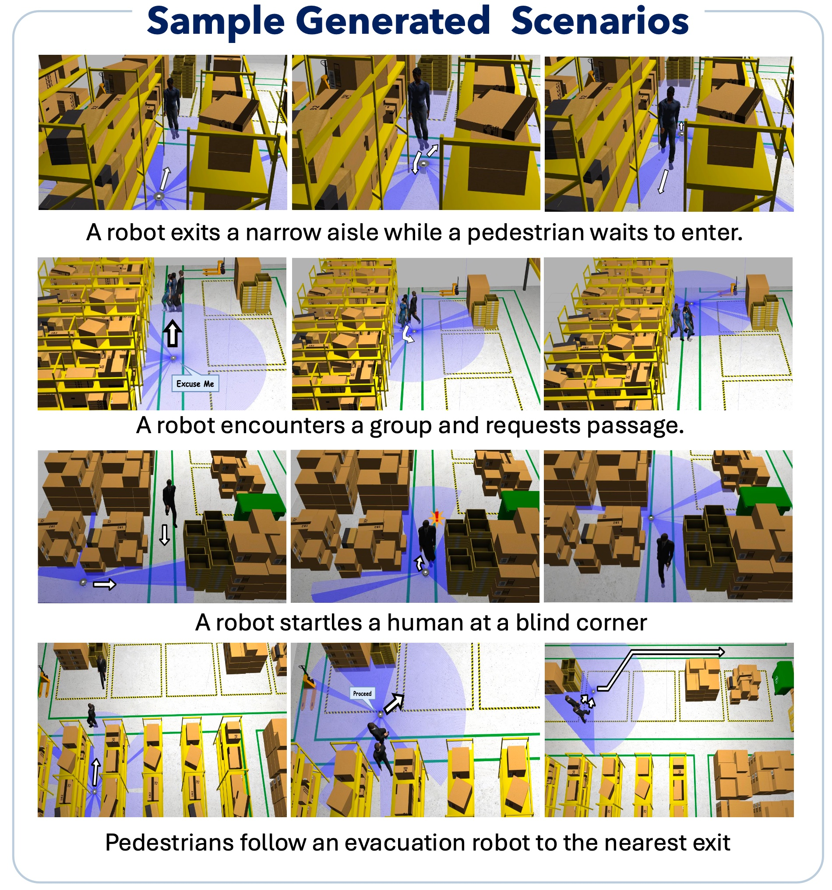

# This package contains code for the paper: ["Towards Automated Scenario Testing of Social Navigation Algorithms"](https://unsolvedsocialnav.org/papers/Marpally.pdf)
A ROS2-Gazebo scenario generator for evaluating social navigation algorithms utilizing LLMs and [Hunavsim](https://github.com/robotics-upo/hunav_sim)

## Installation Instructions
- This package is tested on ROS2 Humble, Gazebo v11.10.2 with python 3.9. Currently, we support querying any GPT-based model.
- Install the required python packages from requirements.txt

SoNAS consists of 3 submodules: 
    - A scenario generation module that queries LLMs in a structured manner to generate parameters and files for simulating a scenario
    - [Modified version of Hunavsim](https://github.com/robotics-upo/hunav_sim)
    - [Modified version of the Hunavsim wrapper for gazebo](https://github.com/robotics-upo/hunav_gazebo_wrapper)
    - For the 2 ROS2 packages, clone the submodules into your catkin workspace and build with the ROS2 ```colcon``` tool
## Generating your own scenarios
To generate scenarios in your own map, first annotate the map by following the instructions, then generate scenarios and then run the gazebo simulation. 
### Map Annotation (requires map.yaml, map.png and .world files)
- We have provided sample maps in the ```locations``` folder. Jump directly to Scenario Generation to skip this step. 
1. Update ```annotator/config.yaml``` with the scene graph schema for your map, and the paths to the image files. You can also tune the ```zoom_in``` parameter to comfortably annotate the image and the ```zoom_out``` parameter to save the annotated image with the corresponding zoom. The schema already filled in is for a warehouse map. Use easy to understand/self-explanatory edge and node names. For example, simple-edge(node) for un-noteworthy edges(nodes) and specific names (like blind corner/intersection etc.) for specific locations in the map.
2. Annotate your map image with the annotator tool: 
    - ```cd annotator```
    - ``` python annotator.py```
    - Follow the instructions in the terminal to generate a map image annotated with a scene graph. An example is shown in the [warehouse annotated map](locations/small_warehouse/scene_graph/scene_graph.png). 

### Scenario Generation
1. Configure the ```inputs.yaml``` file and specify the parameters for generating the scenario. Remember to specify the paths for the ROS2 packages depending on your ROS2 workspace. The main inputs are (check out the examples in ```sample_inputs.md```):
    - ```context```: Define the social context in which the robot is performing its task
    - ``` robot task ```: What is the robot's task when navigating the scenario? 
    - ```rough scenario```: Specify if you want to generate a specific scenario. More specific and well defined scenarios tend to work better (Default ```None```).
-   You can also writeup a full scenario in the handcrafted scenario and set ```use_handcrafted_scenario: true```
- If you want to reuse parts of a previously generated scenario like the scenario description, trajectory or the behaviors, set the corresponding variable ```load__component_to_load: true```. For example, to regenerate only the human behaviors and keep the scenario and trajectories, use: 
```
load_scenario_response: true 
load_trajectory_response: true 
load_bt_response: false
```

2. Run the scenario generator with ``` python main.py ```. You will be asked for confirmations for the generated scenarios and trajectories. The scenario generator could fail (LLMs are imperfect.), the script will try to retry scenario generation multiple times, please rerun if there is a full failure. If the trajectories or behaviors fail to generate, the scenarios maybe regenerated. 

### Launching the Scenario in Gazebo
- In a separate terminal, source the environment with ROS2 installed. 
If you've set the paths correctly, the scenario generation script should modify the files in the ```hunav_gazebo_wrapper``` module directy to orchestrate the scenario. 
1. Build your ROS2 workspace with:
```
cd catkin_ws #change to your corresponding workspace
colcon build --packages-select hunav_gazebo_wrapper hunav_sim 
source install/setup.bash
```
2. Launch scenario and Control the robot:
    - Teleoping: ``` ros2 launch hunav_gazebo_wrapper teleop_scenario_lino.launch.py ```. Then, run the teleop node. E.g.: ``` ros2 run hunav_gazebo_wrapper teleop_keyboard_twist ``` to control the robot in another terminal. Publish to the ```/robot_gesture``` topic to make gestures towards humans.
    - Use Nav2 planners: ```ros2 launch hunav_gazebo_wrapper nav2_scenario_lino.launch.py```. Modify ```configs/nav2_params.yaml``` to change planners,controllers etc.
- Note that we use the [linorobot2](https://github.com/linorobot/linorobot2), so follow instructions in this package for setting up the robot, or modify the launch script to launch your own robot. 
- Also note that we throttle the movements of the humans in order to increase the likelihood of the generated scenario to occur in the simulation (for example, we make the human wait at a previous waypoint if the robot has not yet reached the point where the human and the robot must meet for the scenario. )
3. The humans and the robot in our framework can communicate through gestures. Run the following script to observe when the robot/human make a gesture: ```ros2 run hunav_gazebo_wrapper gesture_listener.py```


- You can finetune the scenario parameters by modifying the saved files in the ```responses``` directory and setting the ```load``` parameters (like ```load_scenario_response```) to true and then running ```python main.py```. This will not regenerate the scenario, but update the gazebo simulation. 
